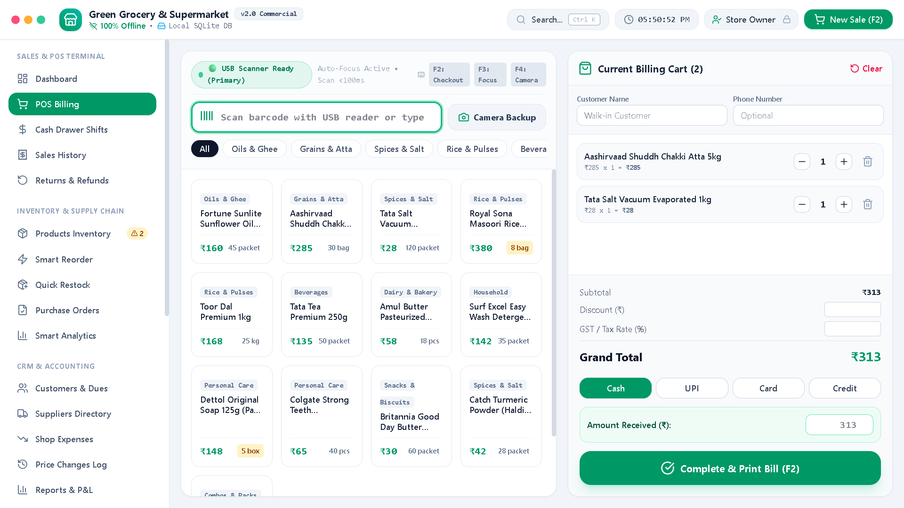
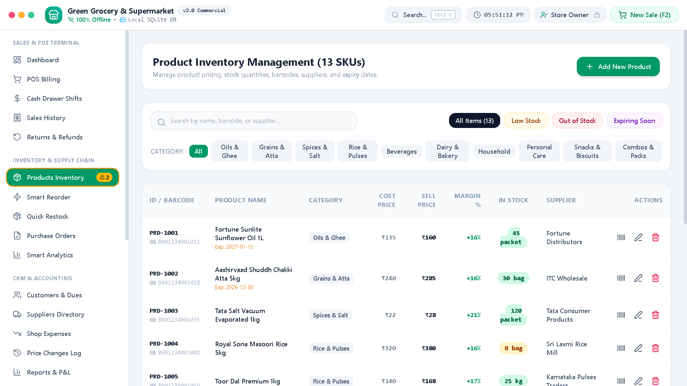
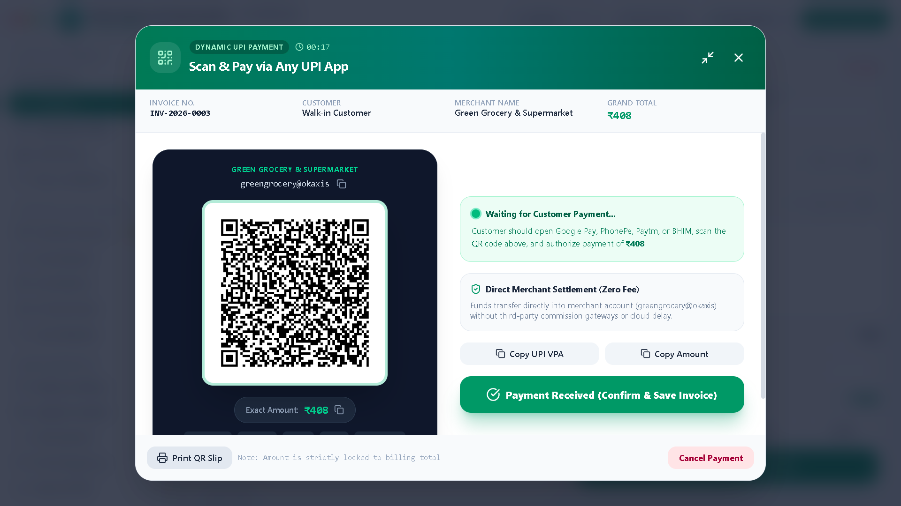
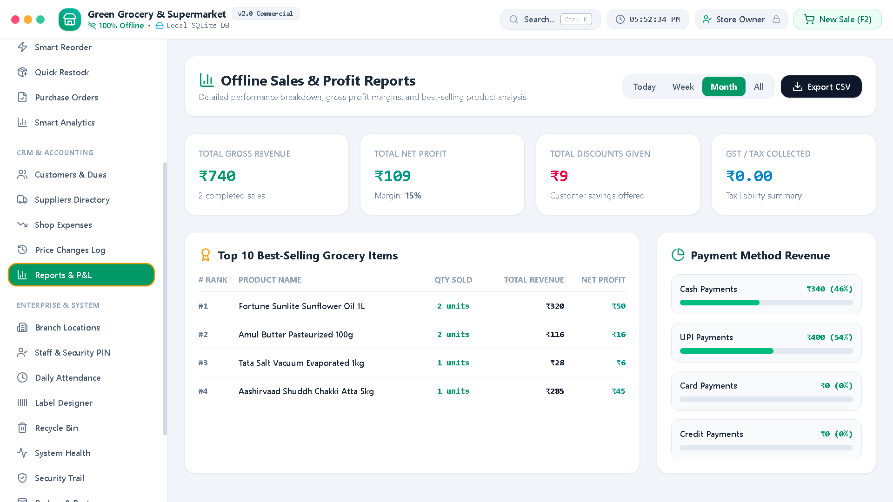

# Grocery POS & Inventory Management System 🛒⚡

> 🚀 A modern offline-first Grocery POS & Inventory Management System built with React, TypeScript, Tailwind CSS, Electron, and SQLite. Designed for supermarkets, grocery stores, and retail businesses.

[](LICENSE)
[](https://react.dev/)
[](https://www.typescriptlang.org/)
[](https://tailwindcss.com/)
[](https://www.electronjs.org/)

A high-performance, **100% Offline-First Grocery POS, Inventory, and Billing System** built with React 19, TypeScript, Tailwind CSS, and Electron. Designed for supermarkets, retail grocery stores, and Kirana outlets requiring instant hardware USB barcode scanning, offline dynamic UPI payments, local SQLite-backed persistence, and AI-driven stock intelligence.

---

## 🌐 Downloads

- 🌍 **Official Website:** https://sksoftware.web.app
- 📦 **Latest GitHub Release:** https://github.com/PplCallMeSk-15/Grocery-Pos-Desktop/releases

---

## 🌟 Key Features

* **⚡ Ultra-Fast Barcode POS Billing**: Sub-100ms USB hardware barcode scanner support (wedge detection), auto-focus guard, audio feedback, and camera scanner backup.
* **📱 Dynamic UPI QR Payment Module**: Generates instant compliant UPI payment QR codes (`upi://pay`) with merchant VPA and exact invoice totals without external payment gateway fees.
* **📦 Complete Inventory & Batch Control**: Track stock quantities, low-stock threshold alerts, cost prices, selling prices, wholesale rates, and expiration dates.
* **🤖 AI-Powered Smart Reordering**: Integrated Google Gemini AI analysis for automated demand forecasting, deadstock warnings, and purchase order drafting.
* **👥 Customer Ledger & Khata Dues**: Track customer credit accounts, transaction histories, and pending balance payments.
* **🏢 Multi-Branch & Employee Security**: Multi-store location switching, staff attendance logs, and PIN-protected admin actions.
* **🧾 Custom Barcode Label & Receipt Designer**: Built-in visual label designer and thermal print engine with custom shop headers and GST formatting.
* **🛡️ Local SQLite Storage & Disaster Recovery**: Embedded client-side SQLite storage with one-click full database JSON export, import, and recycle bin recovery.
* **💻 Desktop Electron Package**: Ready to package into a standalone offline Windows `.exe` installer or Linux AppImage.

---

## 📸 Screenshots

| Billing Terminal (POS) | Smart Inventory & AI Reorder |
| :-: | :-: |
|  |  |

| Dynamic UPI QR Generator | Business Reports & Analytics |
| :-: | :-: |
|  |  |

---

## 🛠️ Tech Stack

* **Frontend**: React 19, TypeScript, Tailwind CSS v4, Lucide React Icons, Motion
* **Barcode Engine**: `@zxing/browser`, `@zxing/library`, `JsBarcode`
* **Desktop Runtime**: Electron 43, `electron-builder`
* **Local Persistence**: Client-side SQLite & IndexedDB storage wrapper
* **AI Integration**: `@google/genai` (Google Gemini API)
* **Build System**: Vite 6, TypeScript 5.8

---

## 📁 Project Folder Structure

```
Grocery-Pos-Desktop/
├── assets/                     # Public static assets & icons
├── docs/                       # Project documentation
│   ├── API.md                  # Internal API reference
│   ├── BUILD.md                # Desktop build guide
│   ├── CONFIGURATION.md        # Configuration settings
│   ├── DEPLOYMENT.md           # Web & local deployment guide
│   ├── INSTALLATION.md         # Setup and installation steps
│   └── FAQ.md                  # Frequently asked questions
├── electron/                   # Electron main & preload scripts
│   ├── main.js                 # Electron main process
│   ├── preload.js              # Electron preload bridge
│   └── README_ELECTRON_WINDOWS_EXE.md
├── release/                    # Output directory for compiled installers
├── screenshots/                # Application preview screenshots
├── src/                        # React application source code
│   ├── components/             # UI Views & Modal components
│   ├── db/                     # SQLite local storage layer
│   ├── services/               # Payment & service utilities
│   ├── utils/                  # Sound & helper functions
│   ├── App.tsx                 # Main application controller
│   ├── main.tsx                # React root renderer
│   ├── index.css               # Tailwind CSS entry
│   └── types.ts                # Global TypeScript definitions
├── .env.example                # Sample environment configuration
├── .gitignore                  # Git ignore directives
├── CHANGELOG.md                # Version history log
├── index.html                  # HTML entry template
├── LICENSE                     # MIT Open Source License
├── package.json                # Project dependencies & npm scripts
├── tsconfig.json               # TypeScript configuration
└── vite.config.ts              # Vite bundle configuration
```

---

## 📋 System Requirements

* **Node.js**: v18.0.0 or higher
* **npm**: v9.0.0 or higher (or `pnpm` / `bun`)
* **OS**: Windows 10/11, macOS, or Linux
* **Hardware**: Any USB Barcode Scanner (HID Keyboard Wedge Mode) or Standard Webcam

---

## ⚙️ Environment Variables

Copy `.env.example` to `.env` in your project root:

```bash
cp .env.example .env
```

Define the following optional key for AI Smart Reordering features:

```env
# Optional Gemini API key for smart stock reordering insights
GEMINI_API_KEY=YOUR_GEMINI_API_KEY

# Application Host URL
APP_URL=http://localhost:3000
```

---

## 🚀 Installation & Quick Start

1. **Clone the Repository**:
   ```bash
   git clone https://github.com/PplCallMeSk-15/Grocery-Pos-Desktop.git
   cd Grocery-Pos-Desktop
   ```

2. **Install Dependencies**:
   ```bash
   npm install
   ```

3. **Start Development Server**:
   ```bash
   npm run dev
   ```
   Open `http://localhost:3000` in your browser.

---

## 🛠️ Build Commands

### Web Build
```bash
npm run build
```
Generates production-ready static web bundle in `dist/`.

### Preview Local Build
```bash
npm run preview
```

### Type Check & Linting
```bash
npm run lint
```

---

## 🖥️ Desktop Build Instructions (Windows `.exe`)

To package this application as a native, standalone offline Windows `.exe` installer:

1. **Install Electron Builder** (included in devDependencies):
   ```bash
   npm install --save-dev electron electron-builder
   ```

2. **Launch Electron Dev Mode**:
   ```bash
   npm run electron:dev
   ```

3. **Compile Windows Installer (`.exe`)**:
   ```bash
   npm run electron:build
   ```

The output executable will be placed in `release/`:
* `Grocery POS & Inventory Software Setup.exe`

---

## ⚠️ Known Limitations

* **Single Device Local Storage by Default**: Data is saved directly inside the browser's local SQLite/IndexedDB engine. For multi-terminal synchronization, export and sync database backups periodically.
* **Thermal Printing**: Web browser security requires confirming the system print dialog unless running inside the native Electron desktop container with silent printing flags enabled.

---

## 🔮 Future Improvements

- [ ] Multi-terminal LAN syncing over local network WebSocket server.
- [ ] Direct integration with Thermal POS printers via WebBluetooth / ESC-POS.
- [ ] WhatsApp API Integration for automated digital customer receipt dispatch.
- [ ] Native Android POS Tablet app using Capacitor / React Native.

---

## 📄 License

Distributed under the **MIT License**. See [`LICENSE`](LICENSE) for more details.

---

## 🤝 Contribution Guide

Contributions are welcome!
1. Fork the Project
2. Create your Feature Branch (`git checkout -b feature/AmazingFeature`)
3. Commit your Changes (`git commit -m 'Add some AmazingFeature'`)
4. Push to the Branch (`git checkout -b feature/AmazingFeature`)
5. Open a Pull Request

---

## 💬 Support & Contact

For questions or issues, please open a GitHub Issue or reach out via [pplcallmesk15@gmail.com](mailto:pplcallmesk15@gmail.com).

---

## 👤 Author

**PplCallMeSk15**

- GitHub: https://github.com/PplCallMeSk-15

---

## ⚠️ Disclaimer

*This software is provided "as is" without warranty of any kind. Users are responsible for ensuring compliance with local taxation laws, GST reporting, and merchant UPI payment guidelines.*
